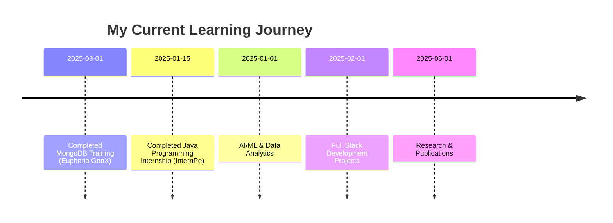

<div align="center">

## 👨‍💻 Welcome to Abhijit's place


<p align="center">
  
  
</p>

</div>


## 🌐 Connect With Me

<div align="center">
  
[](https://abhijitjhaportfolio.vercel.app/)
[](https://www.linkedin.com/in/abhijit-jha-95191526b/)
[](mailto:abhijitjha1801@gmail.com)
[](https://github.com/abhijit1901)

</div>


## 💫 About Me In Nutshell


```javascript
const abhijit = {
    pronouns: "He/Him",
    location: "West Bengal, India",
    currentFocus: "Full Stack Development & AI/ML",
    portfolio: "https://abhijitjhaportfolio.vercel.app/",
    education: {
        degree: "B.Tech in Computer Science Engineering (AI & ML)",
        gpa: "8.18/10",
        college: "Dr Sudhir Chandra Sur Institute of Technology and Sports Complex",
        graduation: "2026"
    },
    technologies: {
        languages: ["Java", "Python"],
        webDevelopment: ["HTML", "CSS", "JavaScript", "React.js", "Express.js", "Node.js", "MongoDB", "REST API", "Tailwind CSS", "SQL", "JWT"],
        dataAnalytics: ["NumPy", "Pandas", "Matplotlib", "Seaborn", "EDA", "Feature Engineering"],
        tools: ["Git", "GitHub", "Postman", "Jupyter", "VS Code", "IntelliJ", "Eclipse"],
        coreConcepts: ["OOPS", "Java Collection Framework", "Streams", "DBMS", "SDLC", "Computer Network", "Machine Learning"]
    },
    achievements: [
        "Published research paper in JCSIR Journal (2025)",
        "Best Paper Award at RAICCIT 2025, JIS University",
        "Solved 270+ algorithmic problems across major coding platforms [LeetCode, GeeksforGeeks, Code360 by CN]"
    ],
    trainings: [
        "30-hour MongoDB training at Euphoria GenX (Mar 2025)",
        "Java Programming Internship at InternPe (Dec 2024 - Jan 2025)"
    ]
};
````

## 🎯 Featured Projects

<details>
<summary>🏠 <b>Wanderlust – Full-Stack Web Application</b></summary>

*Inspired by Airbnb*

<p>
  
  
  
</p>

**✨ Key Features:**

* Secure username/password authentication & authorization
* Property listings and search by location/type
* MongoDB persistence for user, property, and booking data

[](https://github.com/abhijit1901/WEB--DEV-PROJECT-WANDERLUST)
[](https://backend-h6p7.onrender.com/)

</details>


<details>
<summary>✍️ <b>Full-Stack Blogging Platform – BLOGOPEDIA</b></summary>

<p>
  
  
  
  
</p>

**✨ Key Features:**

* JWT authentication and Role-Based Access Control (RBAC)
* RESTful APIs with MongoDB/Mongoose
* Secure password hashing (bcrypt) & flash messages

[](https://github.com/abhijit1901/BLOGOPEDIA)

</details>


💡 *Checkout My Git repos for More of my work!*  
[](https://github.com/abhijit1901?tab=repositories) 
[](https://abhijitjhaportfolio.vercel.app/)


## 🛠️ Technology Stack

<div align="center">

### **Languages**
<p>
  
  
</p>

### **Web Development**
<p>
  
  
  
  
  
  
  
  
  
  
  
</p>

### **Data Analytics**
<p>
  
  
  
  
</p>

### **Tools**
<p>
  
  
  
  
  
  
  
</p>

### **Core Concepts**
<p>
  
  
  
  
  
  
  
</p>

</div>


## 📊 Competitive Programming Dashboards 
### Solved 350+ algorithmic problems across major coding platforms [LeetCode, GeeksforGeeks, Code360 by CN]

<div align="center">

[](https://leetcode.com/u/Abhijit_Jha2003/)

[](https://www.geeksforgeeks.org/user/abhijitjrnaw/)

</div>


## 🎯 What I'm Up To




## 💭 Random Dev Quote

<div align="center">
  
</div>


<div align="center">

### 🌟 "Code is like humor. When you have to explain it, it's bad." – Cory House

**Thanks for visiting! Let's connect and build something amazing together! 🚀**

[](https://abhijitjhaportfolio.vercel.app/)


</div>
